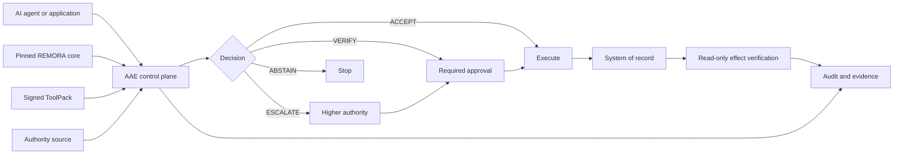

# Assured Agent Execution

[](https://github.com/darklordVirtual/assured-agent-execution/actions/workflows/pr.yml) [](https://github.com/darklordVirtual/REMORA-research) [](https://github.com/darklordVirtual/REMORA-research/blob/master/paper/remora_paper.pdf) [](LICENSING.md)

**Controlled execution for AI-agent tool calls.**

Powered by [REMORA](https://github.com/darklordVirtual/REMORA-research).

Assured Agent Execution (AAE) governs how AI agents interact with tools and
operational systems.

Every proposed tool call receives one of four decisions:

| Decision | Action |
| --- | --- |
| **ACCEPT** | Execute automatically |
| **VERIFY** | Require approval |
| **ABSTAIN** | Stop |
| **ESCALATE** | Route to a higher authority |

AAE binds authorization to the exact tool call, separates approval from
execution, verifies selected effects against the system of record, and records
the complete execution lifecycle.

## Architecture



## Core capabilities

* Four-way decision routing
* Exact-payload approval binding
* Separate identities for proposing, approving and executing
* Deployment-controlled ToolSpecs
* Pinned and verified REMORA artifacts
* Read-only postcondition verification
* Replay-resistant execution grants
* Lifecycle and evidence export

## Quickstart

### Requirements

* Docker with Docker Compose
* Python 3.11 or newer
* Authenticated GitHub CLI (`gh`)

```bash
git clone https://github.com/darklordVirtual/assured-agent-execution
cd assured-agent-execution

python run.py up
python run.py scenarios
python run.py bench
```

`python run.py up`:

1. fetches and verifies the pinned REMORA artifacts;
2. creates installation-specific credentials;
3. signs the ToolPack;
4. builds the containers;
5. applies the database migrations;
6. starts the control plane, the assurance console and the lab.

Three URLs are printed when startup completes:

| | What it is |
|---|---|
| **API** | the governance API an agent calls |
| **Console** | read-only assurance: what was decided, what the controls stopped, and whether any of it can be relied on. One viewer token, no route that writes |
| **Lab** | compose a call, act in any role, read the whole decision envelope, run the benchmarks. Holds every role token and has no login — a demonstration surface, deliberately separate from the console |

## Reference scenarios

The included work-order ToolPack demonstrates the complete execution flow:

```text
ACCEPT     Grounded read executes automatically
VERIFY     Production write requires approval
ABSTAIN    Unresolved authority stops the request
ESCALATE   Destructive action requires senior authority
BINDING    Approval cannot be reused for another payload
ROLES      An approver cannot execute its own approval
```

The main governed path is:

```text
propose → assess → approve → execute → verify effect → record
```

To try to get past these controls yourself, see
[Attack the demo](docs/tutorials/attack-the-demo.md).

## REMORA integration

AAE runs REMORA's governance engine, consumed as a fixed set of released
artifacts rather than from its main branch. Every artifact is verified before
anything uses it, and the install refuses on a mismatch.

Which artifacts, the current values, and how to move to a newer release:
[The pinned core](docs/pinned-core.md).

## Repository structure

```text
src/aae/                  CLI, configuration, evidence and verification
toolpacks/work_order/     Reference ToolPack
db/workorders/            Example system-of-record schema
console/                  Assurance console (read-only) and lab (can act)
benchmarks/               Scenarios, sealed answer keys
docker/                   Container definitions
product/                  Pinned REMORA artifacts and metadata
tests/compatibility/      Core compatibility tests
tests/e2e/                Execution and security tests
docs/                     Architecture, security model and operations
```

## Commands

```bash
python run.py up          # Start the stack
python run.py scenarios   # Run the reference scenarios
python run.py bench       # Score the decisions against a sealed key
python run.py doctor      # Inspect the deployment
python run.py check-sign  # Verify the ToolPack
python run.py check       # Contract tests, no Docker required
python run.py verify      # Contract and end-to-end tests
python run.py down        # Stop the stack
python run.py reset       # Stop and remove all volumes
```

`backup`, `restore`, `sbom`, `sign` and `reseed` are documented in
[Operations](docs/operations.md).

## Documentation

* [Architecture](docs/architecture.md) — components, data flow and boundaries
* [The pinned core](docs/pinned-core.md) — what is pinned, and how it is verified
* [Benchmarks](docs/benchmarks.md) — blind scoring against a sealed key, and the audit trail
* [Build on this](docs/onboarding.md) — adding your own tools, from clone to first governed call
* [Security model](docs/security-model.md) — what is enforced, and by what
* [Limitations](docs/limitations.md) — known gaps
* [Operations](docs/operations.md) — signing, backup, evidence and upgrades
* [Attack the demo](docs/tutorials/attack-the-demo.md) — try to get past the controls
* [Decision records](docs/adr/) — why the architecture is the way it is

## Security

Report suspected vulnerabilities to support@luftfiber.no rather than in a
public issue. [SECURITY.md](SECURITY.md) states the scope;
[docs/security-model.md](docs/security-model.md) states control by control
what is enforced and what is only declared.

## Non-claims

AAE does not claim that agents are always correct, that all tools can be
effect-verified, that safety is guaranteed, or that bypass is impossible when
an agent retains direct tool credentials.

## License

Source-available under the Business Source License 1.1.

See [LICENSING.md](LICENSING.md) for permitted use and commercial terms. The
pinned REMORA core is a separate Licensed Work under the same licensor.
